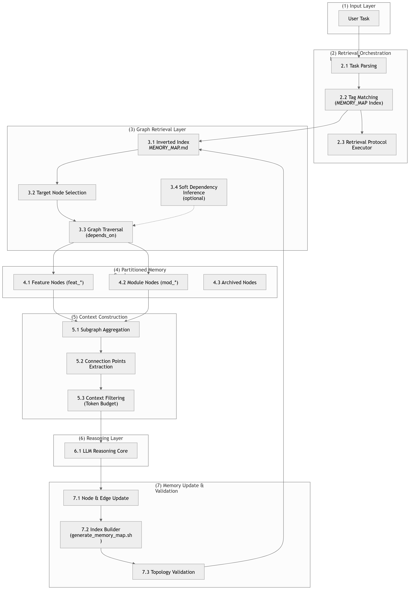

# Synapse

<p align="center">
  <br>
  <em>Graph-Based Partitioned Memory for AI Agents</em>
</p>

<p align="center">
  <a href="LICENSE"></a>
</p>

---

## What is Synapse?

Synapse loads only the subgraph of memory nodes relevant to the current task, using explicit `depends_on` edges for deterministic traversal instead of vector similarity or flat-file scanning.

> **Core principle**: Partitioned loading via graph topology with progressive disclosure — triage by summary, commit to full nodes only when confirmed relevant.

> **Measured (synthetic)**: ~71% average token reduction vs naive full-load baseline across 8 simulated tasks on a 10-module project (~750 tokens loaded per task vs ~2,600 tokens of flat context). Against a "smart flat" baseline that searches and only reads relevant sections, the reduction is ~46%. No cross-module context loss in the simulation. Reproduce: `bash scripts/benchmark.sh setup && bash scripts/benchmark.sh run`. [Full report →](USAGE.md#testing--benchmarking)

If RecallLoom answers "what happened?", Synapse answers "what do I need to know *right now*?"

---

## The Problem

Flat memory files (RecallLoom-style) work perfectly for small projects. But as a project grows — frontend, backend, database, auth, payments — the single `rolling_summary.md` becomes a landfill. When the Agent only needs to fix a button color, it's forced to load database schema into context.

**This is the flat-memory information density collapse.**

Synapse solves this by organizing memory as a graph. The Agent loads only the target node and the relevant subgraph via bounded BFS traversal (depth ≤ 2, width ≤ 5) — nothing else.

---

## Architecture

```
                    ┌─────────────────────┐
                    │    MEMORY_MAP.md     │  ← Auto-generated tag index (O(1) lookup)
                    │  (DO NOT EDIT        │
                    │   MANUALLY)          │
                    └────────┬────────────┘
                             │
              ┌──────────────┼──────────────┐
              ▼              ▼              ▼
     ┌────────────┐  ┌────────────┐  ┌────────────┐
     │ mod_auth   │  │ feat_login │  │ mod_db     │
     │ -api.md    │◄─┤ .md         ├─►│ -schema.md │
     └──────┬─────┘  └────────────┘  └────────────┘
            │
            │  depends_on / blocks (auto-computed reverse edges)
            │
     ┌──────▼─────┐
     │ feat_oauth │
     │ .md        │
     └────────────┘
```

<p align="center">
  
</p>

---

## How It Works

### Three CS Primitives in LLM Context Management

| Concept | CS Primitive | Why |
|---|---|---|
| `MEMORY_MAP` + tag index | **Inverted Index** | O(1) lookup, never scans all files |
| `MEMORY_MAP` + keyword index | **Semantic Fallback** | Tag synonyms or width limits → keyword match (auto-extracted APIs, tables, configs) |
| Node `summary` field | **Progressive Disclosure Layer 1** | Triage by one-line summary before loading full node (~50-100 tok vs ~400-1200 tok) |
| Domain-split nodes, on-demand load | **Normalization** | Eliminates redundancy, isolates irrelevant data |
| `depends_on` edges + bounded BFS traversal | **Foreign Key References** | Deterministic routing — not "semantically similar" guessing |

### Node Types

| Prefix | Type | Lifecycle |
|---|---|---|
| `mod_` | Persistent architecture module | Active forever (routing, state management, DB schema) |
| `feat_` | Lifecycle-bound feature | active → stable → archived |

### Query Routing

| User says... | Mode | Reads |
|---|---|---|
| "咱们做的咋样了" | **Status Digest** | `MEMORY_MAP.md` only (~200 tokens) |
| "还有什么没做完" | **Status Digest** | Same, filter `in-progress` |
| "登录做得怎么样了" | **Bounded BFS** | `feat_login.md` + deps |
| "FastAPI 接口写完没" | **Bounded BFS** | `mod_auth-api.md` + deps |
| "支付超时怎么改" | **Bounded BFS + Impact** | Target + deps + downstream contracts |

**Status Digest** is a lightweight section auto-generated in `MEMORY_MAP.md` — one line per node with status, last update, open issues count. Vague queries like "how's the project going" answer from this single section without loading any node files.

**Trigger Patterns**: Agent detects phrases like "XX做得怎么样了"/"XX的状态"/"继续做XX" and automatically activates memory lookup before responding.

---

## What's New in 0.3.0

| Feature | What it gives you |
|---|---|
| **Filtered BFS for compound queries** | Queries like *"上周支付模块的鉴权改了什么"* are decomposed into time + domain + sub-domain + action filters. BFS only follows edges matching all dimensions, instead of loading the whole payment subgraph. |
| **Progress Summary at session end** | `session-end.sh` emits a structured digest of touched nodes, frontmatter changes, and source→memory drift hints — replacing free-form Agent recap. |
| **Tag aliases** | `aliases:` field in frontmatter (e.g. `[auth, login, signin]`) — query "登录" hits `mod_auth-api` even though the canonical tag is `auth`. Eliminates the "wrong tag, no result" failure mode. |
| **`pre-read-check.sh` hook** | Hard-enforces the BFS budget on every `Read meta/*.md`. When width > 5 or depth > 2, the hook injects a reminder before the read returns — protocol can no longer be silently violated. |
| **`pre-modify-check.sh` hook** | Before any `Write`/`Edit` to source files, scans nodes that reference the file and surfaces their `blocks` list (downstream consumers). The Agent edits with full impact context. |
| **`init.sh` cold-start wizard** | Auto-detects stack, infers module boundaries, generates `mod_*.md` skeletons, installs hooks, registers `.claude/settings.json`. From zero to working graph in one command. |

---

## Quick Start

> **Requirements**: bash 4+ (macOS ships with bash 3.2; install via `brew install bash`), `awk`, `grep`, `sed`. Optional: `jq` for full BFS audits in `parse-session.sh`.

### Option A — One-command wizard (recommended)

```bash
bash .claude/skills/synapse-graph-memory/scripts/init.sh
```

`init.sh` auto-detects the tech stack (Node/Go/Python/Rust/Java) and database, infers module boundaries from your directory layout (`src/api`, `src/auth`, `src/db`, …), generates `mod_project.md` plus per-module skeletons, copies all four hook scripts into `scripts/hooks/`, registers them in `.claude/settings.json`, and builds the first `MEMORY_MAP.md`. Re-runnable: existing nodes are skipped, never overwritten.

### Option B — Manual setup

```bash
# 1. Initialize Synapse in your project
mkdir -p meta/archive scripts

# 2. Copy the generation script
cp .claude/skills/synapse-graph-memory/scripts/generate_memory_map.sh scripts/
chmod +x scripts/generate_memory_map.sh

# 3. Create your first module node
cat > meta/mod_project.md << 'EOF'
---
id: mod_project
type: module
status: in-progress
updated: $(date +%Y-%m-%d)
summary: "Project overview and architecture decisions. Entry point for new sessions."
depends_on: []
tags: [project, overview]
---

# Project Overview

## Current State
[Describe your project architecture here. Preserve exact paths, versions, configs.]

## Key Decisions
- Decision — rationale

## Cross-Module Connection Points
None yet.

## Open Issues
None.

## Change Log
- Initial creation
EOF

# 4. Generate the index
./scripts/generate_memory_map.sh

# 5. Install pre-commit hook
echo '#!/bin/sh' > .git/hooks/pre-commit
echo 'scripts/generate_memory_map.sh' >> .git/hooks/pre-commit
chmod +x .git/hooks/pre-commit
```

---

## Synapse vs RecallLoom

| | RecallLoom (Flat) | Synapse (Graph) |
|---|---|---|
| **Best for** | Small projects, single domain | Multi-domain projects, 10+ modules |
| **Context purity** | Low — everything in one file | High — only relevant subgraph loaded |
| **Setup cost** | Near zero | ~5 minutes |
| **Cross-module work** | All context always loaded | Traverse edges to find related nodes |
| **Risk** | Token waste, hallucination from noise | Graph drift if hooks misconfigured (auto-enforced by default) |
| **Learning curve** | None | 7-step retrieval protocol |

> **They are complementary.** Use RecallLoom for rapid prototyping. Graduate to Synapse when cross-domain noise becomes visible.

---

## File Structure

```
project/
├── MEMORY_MAP.md              ← Auto-generated index (DO NOT EDIT)
├── meta/
│   ├── mod_*.md               ← Persistent module nodes
│   ├── feat_*.md              ← Feature nodes (active/stable)
│   └── archive/               ← Archived features
├── scripts/
│   ├── generate_memory_map.sh ← Index generator + topology validator + JSON mirror
│   ├── suggest_edges.sh       ← Auto-detects dependency edges from Connection Points
│   ├── init.sh                ← One-command cold-start wizard
│   ├── benchmark.sh           ← Token efficiency simulation (Synapse vs flat)
│   └── hooks/
│       ├── pre-read-check.sh   ← Enforces BFS budget (depth ≤ 2, width ≤ 5) on every Read
│       ├── pre-modify-check.sh ← Surfaces downstream consumers before Write/Edit
│       ├── post-tool-use.sh    ← Validates frontmatter after edits
│       └── session-end.sh      ← Auto-rebuilds MAP at session end
├── .claude/
│   ├── settings.json          ← Hook registration
│   └── skills/synapse-graph-memory/
└── .git/hooks/pre-commit      ← Auto-rebuild on commit
```

---

## Hooks: Infrastructure-Level Enforcement

Synapse uses Claude Code hooks to **enforce memory integrity automatically** — no Agent self-discipline required.

| Hook | Event | What it does |
|---|---|---|
| `pre-read-check.sh` | Before every `Read` of `meta/*.md` | Tracks consecutive node loads; warns when BFS budget (depth ≤ 2, width ≤ 5) is exceeded — pushes a reminder to refocus on the target subgraph |
| `pre-modify-check.sh` | Before every `Write`/`Edit` to non-`meta/` source files | Scans memory nodes referencing the file, surfaces downstream consumers (`blocks`) so the Agent edits with full impact awareness |
| `post-tool-use.sh` | After every `Write`/`Edit` to `meta/*.md` | Validates frontmatter completeness, checks `depends_on` targets exist, verifies `updated` field |
| `session-end.sh` | Session end | Rebuilds `MEMORY_MAP.md`, runs topology validation, outputs change summary, flags source→memory drift |

Configured in `.claude/settings.json`. The Agent doesn't need to remember session wrap — the hook guarantees it.

## The Skill

This project is powered by the `synapse-graph-memory` skill at `.claude/skills/synapse-graph-memory/SKILL.md`. Load it into your Agent to enforce the retrieval protocol, fidelity rules, and cleanup workflow.

---

## License

Apache 2.0 © 2026

---

## Related Projects

- [RecallLoom](https://github.com/Frappucc1no/recall-loom)— Flat-file memory for small projects (the precursor to Synapse)
  - [Microsoft GraphRAG](https://github.com/microsoft/graphrag) — Enterprise-scale graph retrieval (the academic foundation)
